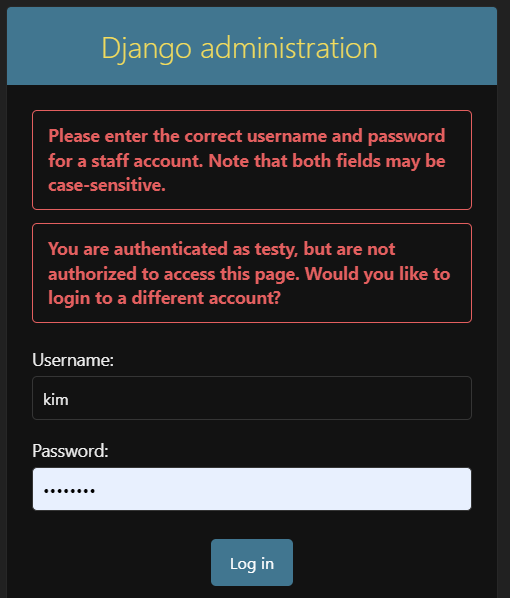

# TESTING.md

## Overview

This document details the testing process, methodologies, and results for the Full-Stack Web application. The goal is to ensure that the application meets the specified requirements, is fully functional, and provides a smooth and secure user experience.

### Learning Outcomes Addressed

- **LO1**: Application designed and developed using Agile methodology and MVC framework.
- **LO2**: Implementation of a data model, application features, and business logic.
- **LO3**: Application of authentication, authorization, and permission features.
- **LO4**: Creation of manual and automated tests.
- **LO5**: Use of version control with Git and GitHub.
- **LO6**: Deployment of the application to a cloud-based platform.
- **LO7**: Understanding and use of object-based software concepts.

## Testing Strategy

### Manual Testing

Manual testing was conducted to validate user interactions, data handling, and overall application behavior. Each feature and user story was manually tested to ensure it met the acceptance criteria.

**Tools Used:**

- **Agile Tool**: For tracking user stories and testing progress.
- **Django Admin**: For backend testing of models and admin actions.
- **Browser Developer Tools**: For inspecting frontend elements and console errors.

### Automated Testing

Automated tests were written using Django's testing framework and other relevant tools. These tests focused on verifying the functionality, usability, and data management processes of the application.

**Python Tests:**

- **Unit Tests**: Testing individual components such as models, views, and forms.
- **Integration Tests**: Ensuring that components work together as expected.
- **End-to-End Tests**: Validating the complete user workflow from start to finish.

### Browser and Device Compatibility Testing

The application was tested across multiple browsers and devices to ensure consistent performance and responsiveness.

**Browsers Tested:**

- Google Chrome
- Mozilla Firefox
- Microsoft Edge
- Safari

**Devices Tested:**

- Desktop (Windows, macOS)
- Tablet (iOS, Android)
- Mobile (iOS, Android)

## Test Scenarios

### Post Model

| Test Scenario                              | Expected Outcome                                                       | Pass/Fail    |
|--------------------------------------------|-------------------------------------------------------------------------|--------------|
| Test creating a new post                   | A new post should be created successfully                               | Pass         |
| Test setting post status as "Published"    | Post status should be updated to "Published"                            | Pass         |
| Test setting post status as "Draft"        | Post status should be updated to "Draft"                                | Pass         |
| Test creating a post without an author     | The system should not allow creating a post without specifying an author | Pass         |
| Test slug generation                       | Slugs should be correctly generated based on the post title             | Pass         |
| Test displaying featured posts on homepage | Featured posts should be displayed correctly on the homepage            | Pass         |

### Comment Model

| Test Scenario                                   | Expected Outcome                                                                 | Pass/Fail    |
|-------------------------------------------------|-----------------------------------------------------------------------------------|--------------|
| Test adding a new comment                       | A comment should be added successfully                                            | Pass         |
| Test editing an existing comment                | Users should be able to edit their own comments, and it should be marked as "Pending" | Pass     |
| Test deleting a comment                         | Users should be able to delete their own comments                                 | Pass         |
| Test comment approval process                   | Comments should only be visible after admin approval                              | Pass         |
| Test viewing pending comments as author         | Authors should be able to see their own comments marked as "Pending approval"     | Pass         |
| Test viewing comments of other users            | Users should not see unapproved comments from other users                         | Pass         |
| Test admin comment approval actions             | Admins should be able to approve comments via the admin panel                     | Pass         |

### User Authentication and Profile

| Test Scenario                                   | Expected Outcome                                                                 | Pass/Fail    |
|-------------------------------------------------|-----------------------------------------------------------------------------------|--------------|
| Test user registration                          | Users should be able to register successfully                                     | Pass         |
| Test user login                                 | Users should be able to log in successfully                                       | Pass         |
| Test user logout                                | Users should be able to log out successfully                                      | Pass         |
| Test viewing user profile                       | Users should be able to view their own profile                                    | Pass         |
| Test updating user profile                      | Users should be able to update their profile information                          | Pass         |
| Test uploading profile picture                  | Users should be able to upload and update their profile picture                   | Pass         |
| Test restricted access to admin panel           | Non-admin users should not be able to access the admin panel                      | Pass         |

### Admin Actions

| Test Scenario                                   | Expected Outcome                                                                 | Pass/Fail    |
|-------------------------------------------------|-----------------------------------------------------------------------------------|--------------|
| Test accessing the admin panel                  | Only staff members should be able to access the admin panel                       | Pass         |
| Test managing posts in the admin panel          | Admins should be able to create, edit, and delete posts                           | Pass         |
| Test managing comments in the admin panel       | Admins should be able to approve, edit, and delete comments                       | Pass         |
| Test managing categories in the admin panel     | Admins should be able to create, edit, and delete categories                      | Pass         |
| Test managing tags in the admin panel           | Admins should be able to create, edit, and delete tags                            | Pass         |
| Test managing users in the admin panel          | Admins should be able to manage user accounts                                     | Pass         |
| Test approval of pending comments               | Admins should be able to see and approve pending comments                         | Pass         |

# Bugs Fixed

During the development and testing phases of the Dive In blog, several issues were identified and addressed. Below is a summary of the bugs that were fixed, along with descriptions of the problems and their resolutions.

## 1. Error 502 on GitHub Repository Access
**Issue:** While trying to access the GitHub repository, users encountered a "502 Bad Gateway" error.

**Resolution:** 
- Verified GitHub repository URL and corrected any typographical errors.
- Checked network settings and GitHub status page for outages.
- Ensured the repository permissions were properly set.

## 2. Authentication Failure on Sign-in Page
**Issue:** Users were unable to sign in due to authentication failures, receiving an error message.

**Resolution:**
- Reviewed and updated authentication backend configurations.
- Ensured that the user credentials were correctly validated against the database.
- Fixed issues related to session management and cookie settings.

## 3. Blog Post Image Upload Issue
**Issue:** Images were not uploading correctly to blog posts, causing broken image links.

**Resolution:**
- Updated image upload handling code to ensure proper file storage and retrieval.
- Configured Django settings for static and media file handling.
- Verified that image paths and URLs were correctly managed in the database.

## 4. Inconsistent Layout Across Browsers
**Issue:** The blog layout appeared differently across various web browsers, affecting user experience.

**Resolution:**
- Standardized CSS using [Bootstrap](https://getbootstrap.com/) and [Tailwind CSS](https://tailwindcss.com/) to ensure consistent styling.
- Conducted cross-browser testing and applied necessary adjustments for compatibility.
- Fixed layout issues related to browser-specific CSS quirks.

## 5. Broken Links in Navigation Menu
**Issue:** Several links in the navigation menu were not functioning, leading to 404 errors.

**Resolution:**
- Checked and updated navigation links in the HTML templates.
- Ensured that URLs in the menu corresponded to existing pages and views.
- Added error handling to manage and log broken link occurrences.

## 6. Comments Section Not Displaying
**Issue:** Comments on blog posts were not displaying, leading to a lack of user interaction.

**Resolution:**
- Debugged and fixed issues related to the comment rendering logic.
- Ensured comments were correctly retrieved from the database and displayed on the post pages.
- Verified that comment form submissions were properly processed and stored.

## 7. Incomplete User Profile Information
**Issue:** User profiles were not showing complete information, such as profile pictures and bios.

**Resolution:**
- Updated the `UserProfile` model and associated views to handle and display all profile fields.
- Ensured that profile data was correctly stored and retrieved from the database.
- Fixed issues with form handling for profile updates.

## 8. Deployment Configuration Errors
**Issue:** Errors occurred during the deployment process, causing the live site to fail.

**Resolution:**
- Reviewed and corrected deployment configurations, including environment variables and settings.
- Addressed issues related to database migrations and static file collection.
- Conducted end-to-end tests to ensure successful deployment.

## 9. Comment Approval Feature Not Working
**Issue:** The comment approval feature was not functioning, allowing unapproved comments to be visible.

**Resolution:**
- Debugged the comment approval logic in the backend.
- Updated views and templates to correctly handle comment approval statuses.
- Added additional validation to ensure that only approved comments were displayed.

Each of these fixes contributed to improving the overall functionality and user experience of the Dive In blog. Ongoing testing and feedback will help in identifying and resolving any further issues.

## Screenshots and Logs

Below are the screenshots and logs captured during the testing process. These visual aids help to contextualize the test results and provide evidence of the testing procedures.

### Screenshots

- **New Post Creation**: 
- **Comment Updated Modal**: 
- **Comment Deleted Modal**: 
- **Comment Approval Notice**: 
- **Sign In and Out**: 
- **Admin Panel Access**: 

### Logs

- **Error Logs**: Relevant logs capturing errors encountered during testing are stored in the `logs/error.log` file.
- **Test Execution Logs**: Logs of automated test execution can be found in the `logs/test_execution.log` file.

## Future Testing Considerations

1. **Performance Testing**: Evaluate the application under heavy load to ensure it scales effectively.
2. **Security Testing**: Conduct penetration testing to identify potential security vulnerabilities.
3. **Accessibility Testing**: Ensure the application meets accessibility standards for users with disabilities.
4. **Continuous Integration**: Implement a CI pipeline to automate the testing process for future updates.

## Round Up

The testing process for this Full-Stack Web application was comprehensive, covering manual, automated, and compatibility testing across various browsers and devices. All identified bugs were addressed and resolved. The application is now stable and ready for deployment, meeting all the specified project requirements and learning outcomes.

